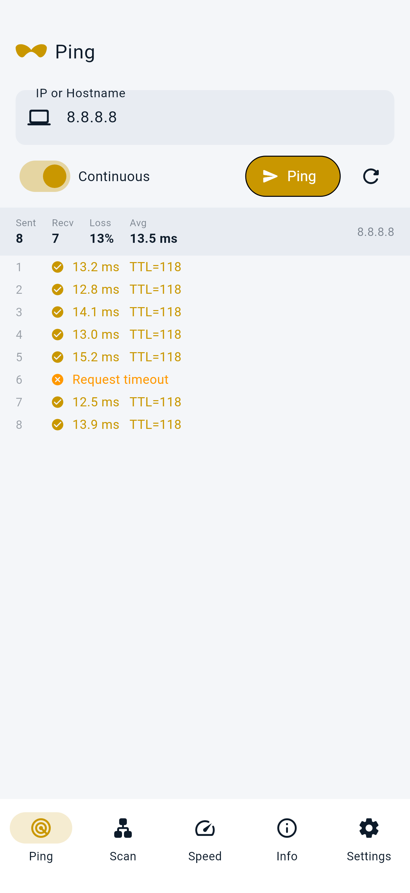
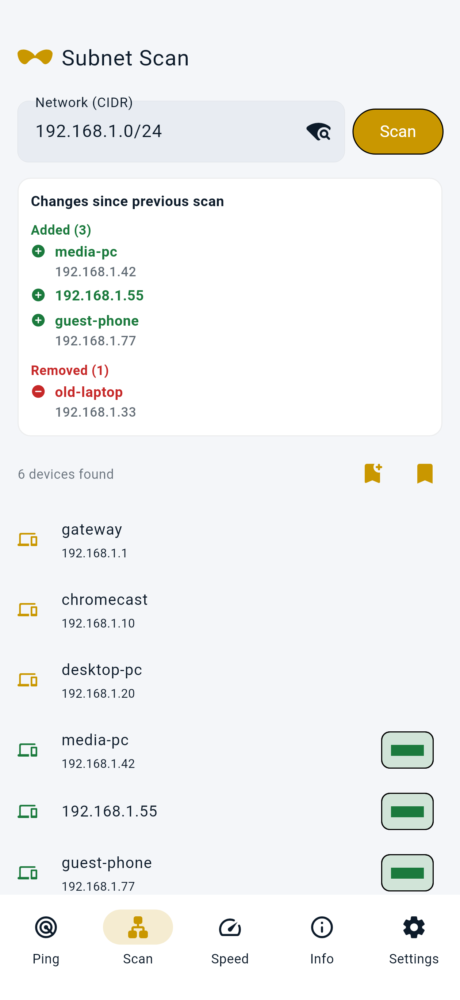
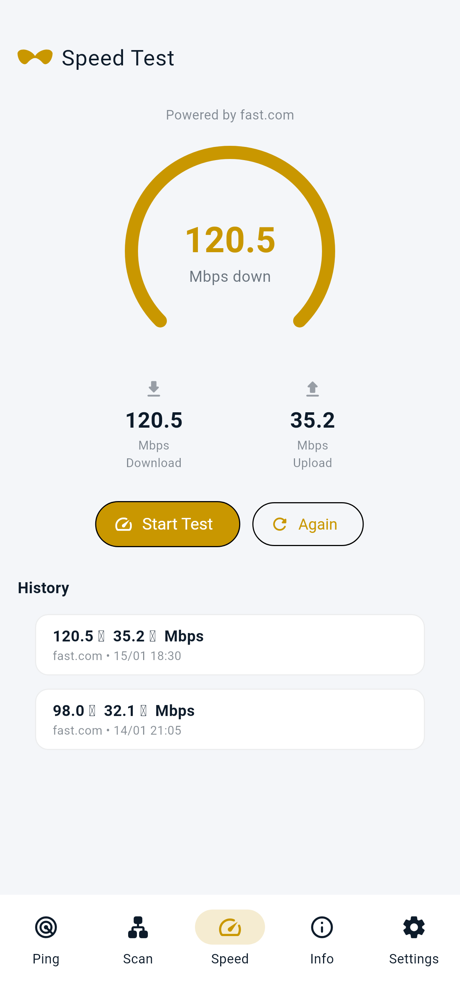
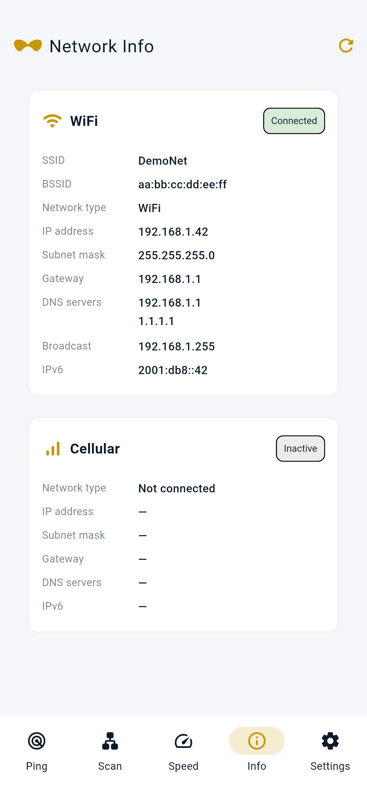
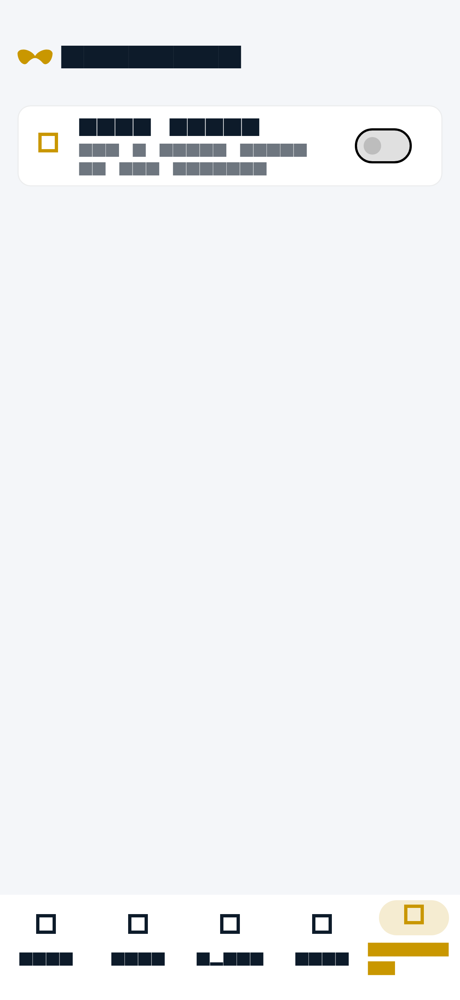
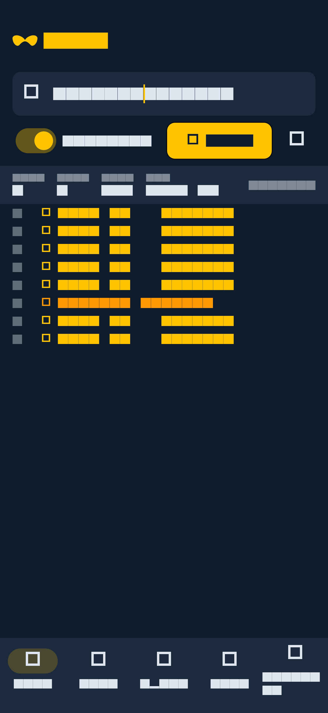
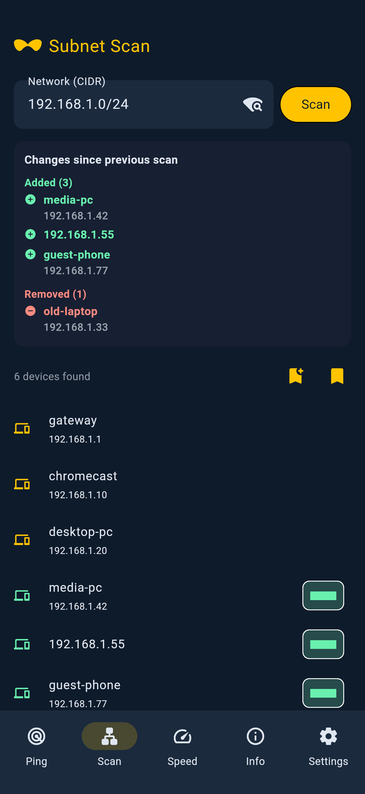
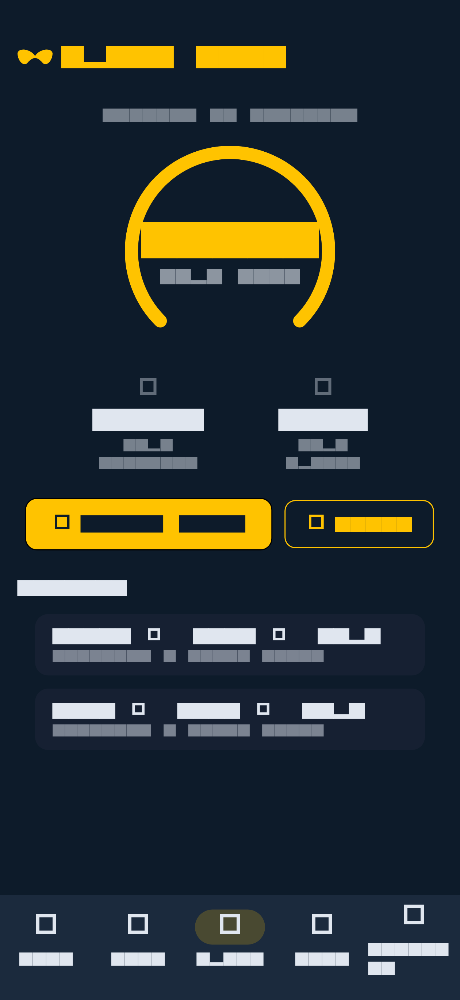
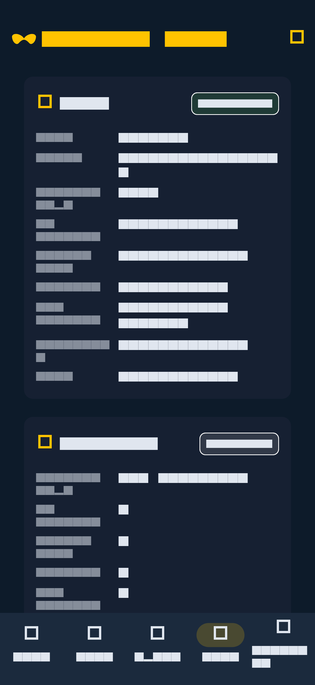
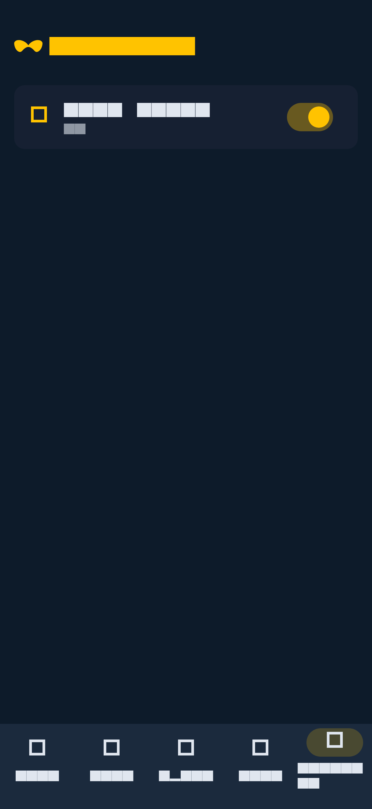

# Moustache Ping 🥸

A network utility Android app built with Flutter — ping, subnet scan with before/after diff, speed test, and network info.

## Screenshots

Demo data only (`DemoNet`, `192.168.1.x`) — not from a real network.

### Light theme (default)

| Ping | Scan | Speed |
|:---:|:---:|:---:|
|  |  |  |

| Info | Settings |
|:---:|:---:|
|  |  |

### Dark theme

| Ping | Scan | Speed |
|:---:|:---:|:---:|
|  |  |  |

| Info | Settings |
|:---:|:---:|
|  |  |

Regenerate screenshots (fictional demo data):

```bash
./tool/capture_screenshots.sh
```

## Features

### 1. Ping
- Ping any IP address or hostname
- Continuous or fixed-count mode (10 packets)
- Live RTT display per packet with TTL
- Packet loss and average RTT summary

### 2. Subnet Scanner
- Auto-detects your current WiFi subnet as CIDR (e.g. `192.168.1.0/24`)
- Concurrent ICMP scan with reverse-DNS hostnames when available
- Auto-diff against the previous scan (added / removed hosts)
- Long-press a host to copy hostname or IP
- Optional saved baselines with history

### 3. Speed Test
- In-app speed test via **fast.com** servers
- Animated speed dial showing live download/upload progress
- History of past tests with timestamp

### 4. Network Info
- Separate WiFi and Cellular cards
- IP, subnet, gateway, DNS (one per line), IPv6, broadcast
- SSID/BSSID via Nearby Wi-Fi Devices on Android 13+ (falls back to location only if needed)

### 5. Settings
- Light theme by default
- Dark theme toggle (persisted)
- App version (marketing name only)

## Tech Stack

| Concern | Package |
|---|---|
| UI / Framework | Flutter 3.44+ (Material 3, light + dark) |
| State management | Riverpod 3.x (`Notifier` + `NotifierProvider`) |
| ICMP Ping | `dart_ping` 9.x |
| Subnet scan | `network_tools` + `network_tools_flutter` |
| WiFi info | `network_info_plus` + native Android `LinkProperties` |
| Speed test | `flutter_internet_speed_test_pro` |
| Local storage | `hive_ce` + `hive_ce_flutter` |

## Permissions (Android)

```xml
INTERNET, ACCESS_NETWORK_STATE, ACCESS_WIFI_STATE,
CHANGE_WIFI_STATE, CHANGE_WIFI_MULTICAST_STATE,
NEARBY_WIFI_DEVICES (neverForLocation),
ACCESS_FINE_LOCATION, ACCESS_COARSE_LOCATION
```

SSID/BSSID: on Android 13+ the app requests **Nearby Wi-Fi Devices** first (not treated as location). If the OS still redacts the Wi-Fi name, it asks for **location when in use** only while Network Info is refreshing — not at every app launch, and never background location. Subnet auto-detect uses WiFi IP + subnet mask (native `LinkProperties`) and does not need location.

## Building

```bash
# Prerequisites: Flutter 3.44+, Android SDK, Java 17+
flutter pub get
dart run build_runner build

# arm64-only release APK (default — covers modern phones)
flutter build apk --release --target-platform android-arm64
# APK: build/app/outputs/flutter-apk/app-arm64-v8a-release.apk
```

## Versioning

The version is tracked in `pubspec.yaml` (`version: X.Y.Z+build`).  
Each release on GitHub is tagged `vX.Y.Z` with the arm64 APK attached.

## License

MIT
